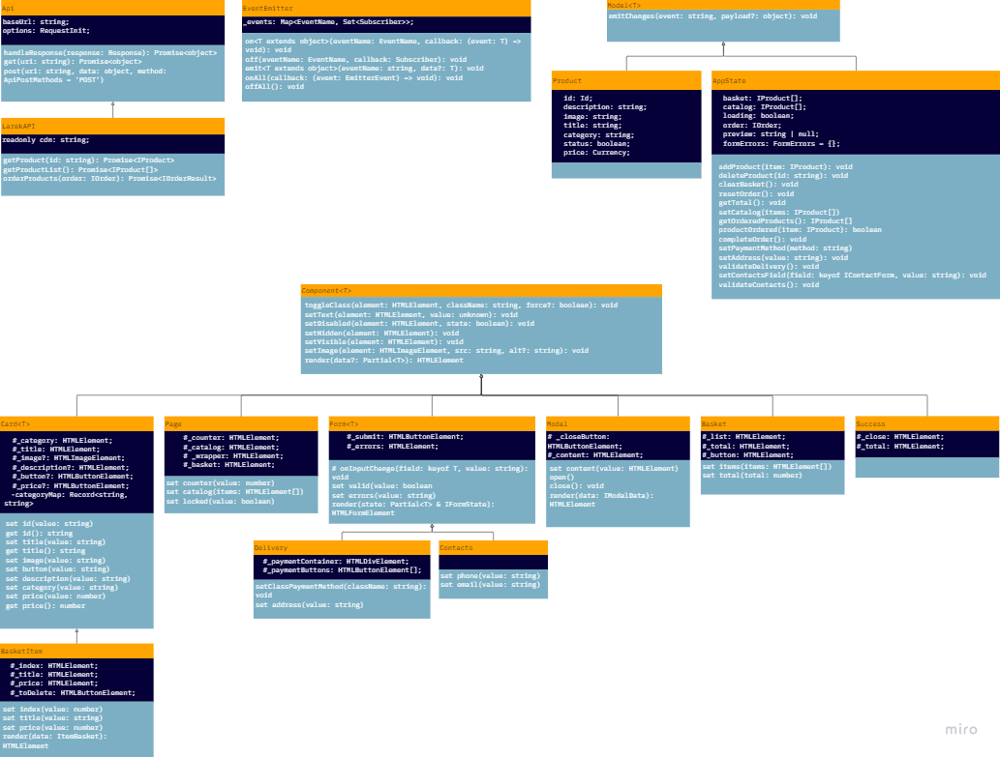

# Проектная работа "Веб-ларек"

Стек: HTML, SCSS, TS, Webpack

Структура проекта:
- src/ — исходные файлы проекта
- src/components/ — папка с JS компонентами
- src/components/base/ — папка с базовыми классами
- src/components/common/ — папка с основными классами

Важные файлы:
- src/pages/index.html — HTML-файл главной страницы
- src/types/index.ts — файл с типами
- src/index.ts — точка входа приложения
- src/styles/styles.scss — корневой файл стилей
- src/utils/constants.ts — файл с константами
- src/utils/utils.ts — файл с утилитами

## Установка и запуск
Для установки и запуска проекта необходимо выполнить команды

```
npm install
npm run start
```

или

```
yarn
yarn start
```
## Сборка

```
npm run build
```

или

```
yarn build
```

## Архитектура


## Описание базовых классов их предназначение и функции
- Класс EventEmitter обеспечивает работу событий. Его функции: возможность установить и снять слушателей событий, вызвать слушателей при возникновении события, слушать все события, сбросить все обработчики
- Класс Api обеспечивает обмен с сервером. Его функции: реализация методов GET и POST, но в общем смысле, вне привязки к модели данных
- Класс LarekAPI, наследуется от Api и имплементирует интерфейс ILarekAPI. Его задача - реализовать обмен данными с сервером с учетом модели данных. Его функции: получить список товаров, получить карточку товара, отправить заказ
- Класс Component, базовый класс для визуализации компонентов приложения. От него наследуются все компоненты представления. Не содержит полей. Его функции: переключиить класс CSS, установить текст, установить/снять состояние Disabled, сделать элемент видимым, сделать элемент скрытым, установить картинку для элемента, отрисовать (render) элемент на странице.
- Класс Model, базовый класс для классов бизнес-модели. От него наследуются классы Product и AppState. Конструктор принимает экземпляр класса EventEmitter и содержит метод-обертку emitChanges для возможности вызвать событие из компонента модели.

## Компоненты представления

- Классы Card, Basket, Form, Modal, Page, Success - классы-наследники класса Component. Предназначены для визуализации соответствующих компонент приложения. В каждом из них реализуется следующий подход:
  - в конструктор принимается HTML элемент, определяющий контейнер для данного компонента, а также объект events (опционально), позволяющий инициализировать событие в EventEmitter из компонента визуализации для дальнейшей обработки,
  - определяются закрытые поля, соответствующие элементам, составляющим компонент, которые должны отображать информацию из модели, реагировать на события от пользователя или принимать данные пользователя;
  - в конструкторе реализуются следующие задачи:
    - вызывается super;
    - по селекторам CSS в контейнере определяются внутренние элементы и сохраняются в закрытие поля;
    - при необходимости навешиваются обработчики событий на элементы;
  - под каждый элемент визуализации определяются сеттеры/геттеры
  - при необходимости перегружается метод render для реализации особенных возможностей визуализации данного компонента

## Компоненты модели данных (бизнес-логика)

- Класс AppState, наследник класса Model. Его задача - хранение данных модели, а также реализация методов изменения данных и инициализация событий для визуализации после изменения данных. Его функции:
  - добавить товар в корзину;
  - удалить товар из корзины;
  - очистить корзину;
  - определить сумму заказа;
  - сформировать массив объектов, содержащих данные карточек товара;
  - получить список товаров в корзине;
  - завершить заказ - перенести в заказ данные из корзины;
  - установить вид оплаты;
  - установить адрес;
  - валидировать доставку;
  - установить поля контактов;
  - валидировать поля контактов;
- Класс Product, наследник класса Model. Его задача - имплементация интерфейса IProduct структуры карточки товара. Не содержит методов, а только поля карточки товара.


## Ключевые типы данных
export type Id = string;
export type Currency = number | null;
export type PaymentMethod = 'card' | 'cash' | '';

// типизация структуры карточки товара
export interface IProduct {
	id: Id;
	description: string;
	image: string;
	title: string;
	category: string;
	price: Currency;
	status: boolean;
}

// типизация полей формы ввода контактов
export interface IContactForm {
	email: string;
	phone: string;
}

// типизация полей формы ввода формы оплаты и адреса
export interface IDeliveryForm {
	payment: PaymentMethod;
	address: string;
}

// расширение типов форм до данных заказа
export type IOrder = IContactForm &
	IDeliveryForm & {
		items: Id[];
		total: number;
	};

// типизация получения ответа сервера на отправку заказа
export interface IOrderResult {
	id: Id;
	total: Currency;
}

// типизация записи об ошибке - поле заказа - текст ошибки
export type FormErrors = Partial<Record<keyof IOrder, string>>;

// типизация данных бизнес-логики приложения
export interface IAppState {
	catalog: IProduct[];
	basket: string[];
	preview: string | null;
	order: IOrder | null;
	loading: boolean;
}


Ссылка на репозиторий https://github.com/vstrogalev/web-larek-frontend